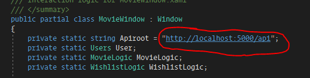

# Developer's Guide

## Setup Information

1. If you are using your own database, change the connection string inside of Startup.cs inside of the api folder to match your connection data

2. If you are using the default front end, make sure you change all instances of Apiroot to match where the api is running

3. To run the api, inside of a bash shell `cd` into the api directory and use the command `dotnet run`

## Api Guide

### `GET /movies`
* Returns a collection of all movies stored in the database. 
* This can be iterated through to return search results. 
* Can be used in conjuction with `GET /wishlist/` to return a collection of movies on a particular user's wishlist.

### `GET /movies/{id}`
* Returns a particular movie according to the id given. 
* Can be used to get all the data for a particular movie when displaying a movie

### `GET /users`
* Returns a collection of all users in the database
* Can be iterated through to find record of a user when authenticating, i.e. when you have the username and password but not the id
* **NOTE:** *This is not a completely secure authentication method and I do not recommend entering any sensitive data. Feel free to make a pull request with an updated authentication method.*

### `PUT /users/{id}`
* Updates the data stored in the database for the user specified with id
* Can be used to allow the user to update their own information in an 'edit profile' section of the application

### `GET /wishlist`
* Returns a collection of all wishlist entries stored in the database
* Can be iterated through to create a collection of all entries containing a particular user's id. This will result in a collection of entries that makes up that user's wishlist.
* The wishlist just mentioned will contain the ids of the movies on a particular user's wishlist, which can be compared against `GET /movies` to return a collection of data for the movies on that user's wishlist. This can be used to display a grid of data for the movies on the wishlist.

### `POST /wishlist`
* Creates a new entry in the database referencing a user and a movie on their wishlist
* Can be used when a user clicks a button to add a movie to their wishlist

### `DELETE /wishlist/{id}`
* Deletes a specified entry from the database, removing a movie from a user's wishlist
* Can be used when a user clicks a button to remove a movie from their wishlist