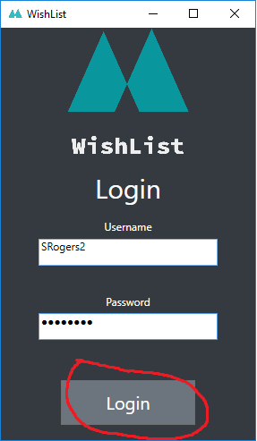
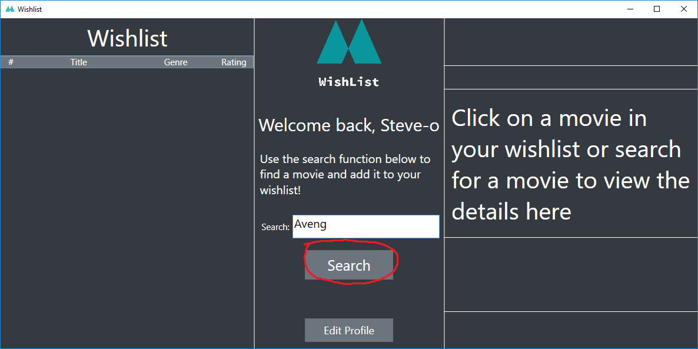
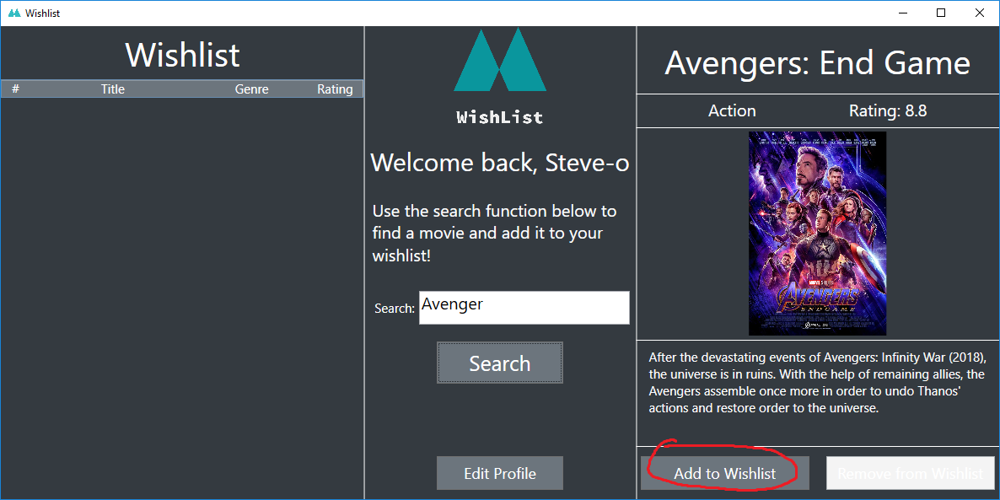
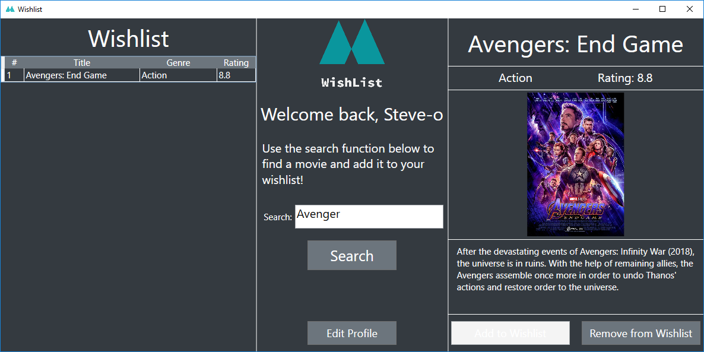
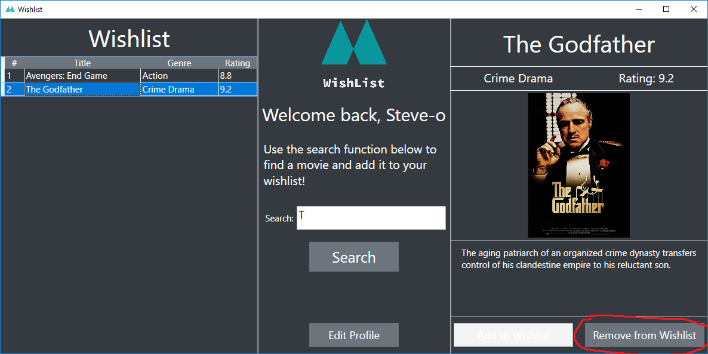
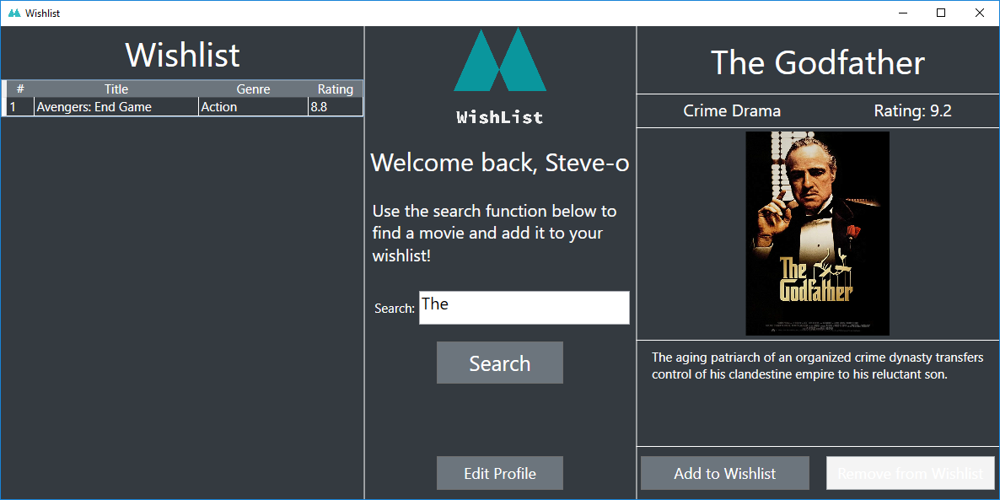
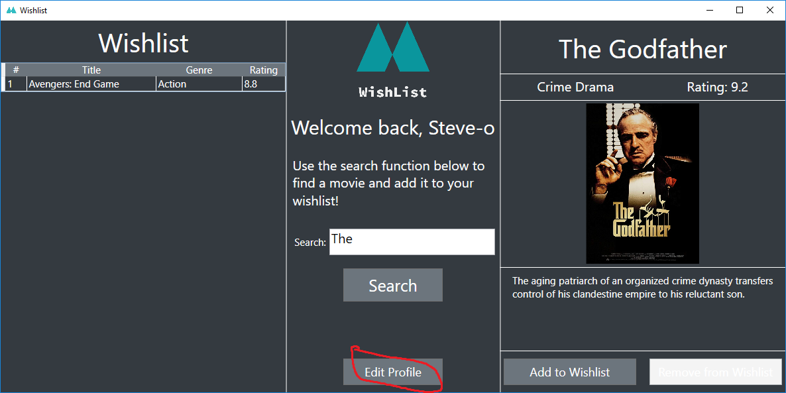
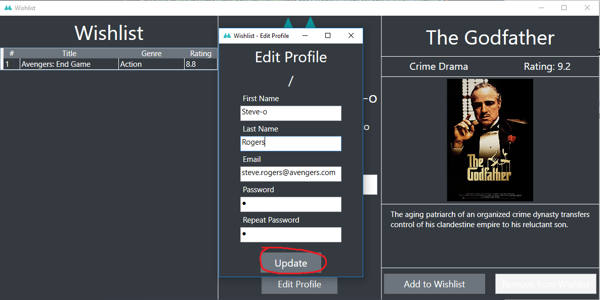

# 6215 Assignment 2
## Dylan Nichols 9994086

* [Click here for the testing document](6215-Assignment2-Testing-Document.docx)
* [Click here for the developer documentation](api-guide.md)
* [Click here for my reasoning behind using WPF](wpf.md)
* Read below for user instructions

# WishList User Guide

1. Enter your username and password and click login
   

2. Type in the name (or part of the name) of the movie you want and click search

3. Once the movie you're after appears in the right pane, click add to wishlist to add it to your wishlist

4. The movie will now appear in the left pane in your wishlist

5. To remove a movie from your wishlist, first click on the movie in your wishlist and then click remove from wishlist

6. The movie will no longer be in your wishlist

7. If you wish to edit your account information, click edit profile

8. Make the changes you'd like to your information then click update